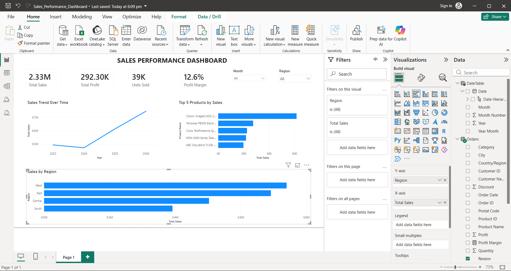

# Sales Performance Dashboard – Power BI

## Project Overview

This project presents an interactive Sales Performance Dashboard developed using Microsoft Power BI and the Sample Superstore dataset.

The dashboard provides a clear view of sales performance, profitability, product performance, regional performance, and sales trends over time.

## Dataset

The project uses the Sample Superstore dataset, which contains order-level business information including:

- Order Date
- Product Name
- Region
- Sales
- Profit
- Quantity

The original dataset is included in this repository as:

`full sample_superstore.xls`

## Tools Used

- Microsoft Power BI
- Microsoft Excel
- GitHub

## Approach

The project was completed through the following steps:

1. Imported and reviewed the Sample Superstore dataset.
2. Created a dedicated Date Table for time-based analysis.
3. Created DAX measures for key performance indicators.
4. Built an interactive Power BI dashboard.
5. Added Month and Region slicers for dynamic filtering.
6. Created visualizations for sales trends, top-performing products, and regional sales.
7. Applied consistent formatting and dashboard layout improvements.
8. Tested the dashboard interactions and validated the final results.

## Key Performance Indicators

The dashboard includes:

- **Total Sales:** 2.33M
- **Total Profit:** 292.30K
- **Units Sold:** 39K
- **Profit Margin:** 12.6%

## Dashboard Features

### KPI Cards

Provides a quick overview of the main business performance indicators.

### Sales Trend Over Time

Shows how sales change across the available date range.

### Top 5 Products by Sales

Highlights the five highest-performing products based on total sales.

### Sales by Region

Compares sales performance across the four regions.

### Interactive Filters

The dashboard includes interactive filters for:

- Month
- Region

The filters can be used individually or together for more detailed analysi

## Dashboard Preview

## Final Outcome

The final Power BI dashboard transforms raw sales data into an interactive business intelligence report.

It enables users to quickly evaluate overall sales and profitability, identify top-performing products, compare regional performance, and analyze sales trends over time.

The dashboard was designed with a clean, consistent layout to support effective business analysis and presentation.

## Files Included

| File | Description |
|---|---|
| `Sales_Performance_Dashboard.pbix` | Final Power BI dashboard |
| `full sample_superstore.xls` | Original Sample Superstore dataset |
| `dashboard-overview.png.png` | Final dashboard screenshot |
| `README.md` | Project documentation |

## Conclusion

This project demonstrates practical skills in Power BI, data modeling, DAX measures, interactive filtering, and business data visualization.

The completed dashboard provides an accessible and interactive view of sales performance and supports data-driven business analysis.

